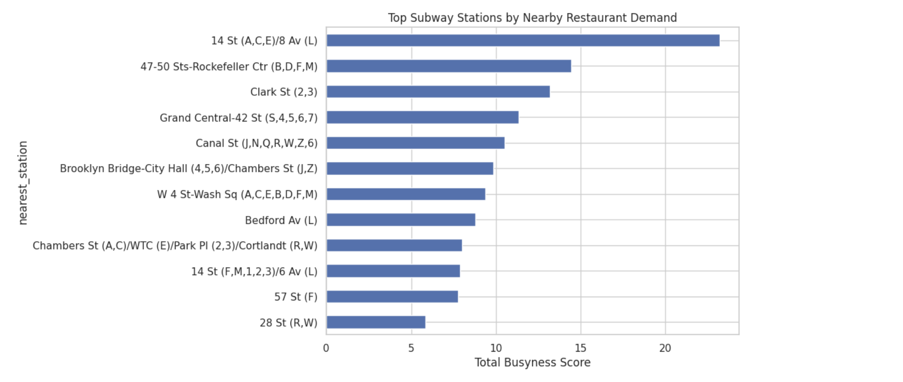

### NYC Restaurant Busyness Predictor (V1)
This project explores what drives restaurant busyness in New York City using real-world data. As an avid foodie and a daily NYC commuter, I often find myself wondering which subway stop to get off at on my way to or from school or work to find good food without long waits. That curiosity led me to build a heatmap based on restaurant density, subway ridership, and distance to transit.

The long-term goal is to use this model to predict how busy restaurants will be on days when my friends and I want to eat out without a reservation, helping us identify areas that are most likely to have good food with reasonable wait times. Over time, this can be further refined by cuisine type, commute patterns, ratings, and reviews.

Beyond prediction, the goal is to understand how location, transit access, and demand interact in an urban environment. To do this, I combined Yelp business data with MTA subway ridership and applied geospatial analysis and machine learning to model patterns of restaurant activity across NYC.

- **Yelp dataset** I have been using the app ever since I came back from undergrad to navigate my way around NYC's food scence, it provides rich restaurant metadata (ratings, reviews, categories, locations). I would love to look at Beli's in the future.
- **MTA ridership data** acts as a proxy for foot traffic and accessibility, trust me I know, I use it every day - hence how we got here.
  
Subway ridership is a strong real-world signal for customer flow in NYC, making it a meaningful feature for modeling restaurant activity.

This project demonstrates an end-to-end applied ML workflow: data ingestion → spatial reasoning → feature engineering → modeling → validation → visualization.

And, based on food density, variety, and accessibility, the analysis consistently points to 14th Street–Union Square as the best subway stop to get off if you’re looking for food in NYC.

### Spatial Heatmap of Restaurant Demand
The heatmap highlights areas with the highest concentration of busy restaurants. Demand is strongest near major subway hubs, especially in Midtown and Lower Manhattan.

### Top Subway Stations by Nearby Restaurant Demand
Stations are ranked by the total predicted busyness of nearby restaurants. This highlights which stops offer the best food density and demand.

### Restaurant Busyness Across NYC
This plot shows restaurant locations colored by predicted busyness. Clear clusters appear in Manhattan and around major transit corridors, indicating strong spatial patterns in demand.

### Tech Stack & Skills
Programming & Tools
#### Python
primary language for data processing, modeling, and visualization
#### Pandas & NumPy
data cleaning, joins, aggregation, and feature engineering
#### Scikit-learn
model training, evaluation, and validation
#### Jupyter Notebooks
exploratory analysis and experimentation

### Data Science & Machine Learning
#### Feature engineering 
from real-world, multi-source datasets
#### Supervised learning 
with Gradient Boosting Regression
#### Model evaluation 
using Mean Absolute Error (MAE)
#### Time-aware validation 
using TimeSeriesSplit
#### Interpreting model behavior 
beyond raw accuracy

### Geospatial Analysis
##### Latitude/longitude 
data handling
#### Haversine distance 
for accurate geographic calculations
#### BallTree 
for efficient nearest-neighbor search
#### Linking restaurants to nearest subway stations 
via spatial indexing
#### Spatial clustering and hotspot analysis

